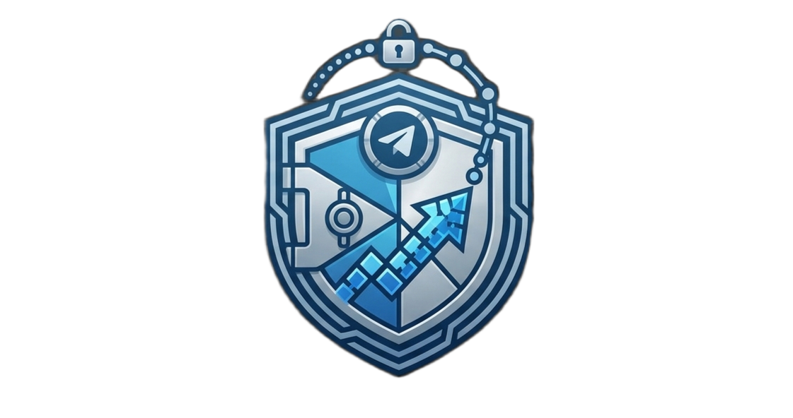

<p align="center">
  
  
  
  
  
</p>

<h1 align="center">
  
  <br>
  Unlimited cloud storage via Telegram
</h1>

<p align="center">
  <strong>Encrypt → Chunk → Upload to your private Telegram channel.</strong><br>
  <strong>No servers. No limits. No trust required.</strong>
</p>

<p align="center">
  <a href="#installation"><code>pipx install televault</code></a>
  <span>&nbsp;·&nbsp;</span>
  <a href="https://yahyatoubali.github.io/televault/">Docs</a>
  <span>&nbsp;·&nbsp;</span>
  <a href="#quick-start">Quick Start</a>
  <span>&nbsp;·&nbsp;</span>
  <a href="./ARCHITECTURE.md">Architecture</a>
</p>

---

## System Architecture

<p align="center">
  
</p>

---

## Why TeleVault?

| | TeleVault | Cloud Storage |
|---|---|---|
| **Cost** | Free (Telegram account) | $5-30/month |
| **Storage Limit** | Unlimited | 15 GB - 2 TB |
| **Encryption** | AES-256-GCM client-side | Server-side or none |
| **Trust Model** | Zero-trust (you hold the key) | Trust the provider |
| **File Size** | Up to 2 GB per file | Varies |
| **Speed** | 8 parallel chunk uploads | Single connection |
| **Low-resource** | Built-in mode for weak machines | N/A |

TeleVault turns a **private Telegram channel** into encrypted, unlimited cloud storage. No local database — everything lives as pinned messages and reply chains in the channel. Your password never leaves your machine.

---

## Features

- **End-to-end encryption** — AES-256-GCM with scrypt key derivation. Telegram only sees ciphertext.
- **Parallel transfers** — 8 upload, 10 download concurrent chunks. 256 MB default chunk size.
- **Resumable uploads/downloads** — CRC32-protected progress files survive interruptions.
- **Data safety** — Atomic config writes, sequential index access (asyncio.Lock), cached index lookups, crash-safe delete/upload/stream.
- **Low-resource mode** — `--low-resource` flag for machines with <2 GB RAM (32 MB chunks, 2 parallel ops).
- **Progress display** — Phase icons, chunk counter, EMA-smoothed speed (e.g. `3/8 chunks  12.3 MB/s`).
- **Git-like backups** — Incremental snapshots with retention policies.
- **FUSE mount** — Mount your vault as a local filesystem with on-demand streaming.
- **WebDAV server** — Access files over HTTP from any device.
- **Terminal UI (beta)** — Interactive file browser with detail panel.
- **Piping** — `cat file | tvt push -`, `tvt cat file | jq`, `tvt ls --json`.
- **Auto-backup** — Schedules, systemd timers, file watching.
- **Garbage collection** — Find and remove orphaned messages (dry-run by default, auto-cleans stale index entries).
- **Async I/O** — Non-blocking file hashing with ThreadPoolExecutor + aiofiles.

---

## Installation

```bash
pipx install televault

# Optional extras
pipx install televault[fuse]       # FUSE mount support (Linux/macOS)
pipx install televault[webdav]     # WebDAV server
pipx install televault[preview]    # Image preview (Pillow)
```

Python 3.11+ is required. [`pipx`](https://github.com/pypa/pipx) is recommended for CLI tools — it installs into an isolated environment so your system Python stays clean.

---

## Quick Start

```bash
# 1) Login (will prompt for API credentials from https://my.telegram.org)
tvt login

# 2) Set up storage (interactive — validates channel, sends test message)
tvt setup

# 3) Upload
tvt push photo.jpg

# 5) List
tvt ls

# 6) Download
tvt pull photo.jpg

# 7) Stream to stdout
tvt cat photo.jpg > photo_copy.jpg

# 8) Preview without full download
tvt preview photo.jpg

# 9) Check channel info
tvt channel
```

---

## Usage

### Core Commands

```bash
tvt push <file>              # Upload a file (use - for stdin)
tvt pull <file>              # Download (use -o - for stdout)
tvt ls [--json]              # List files
tvt cat <file>               # Stream file to stdout
tvt preview <file>           # Preview without full download
tvt find <query> [--json]    # Search files
tvt info <file> [--json]     # Detailed file info
tvt stat [--json]            # Vault statistics
tvt rm <file>                # Delete file
tvt verify <file>            # Verify integrity
tvt gc [--force]             # Garbage collection (dry-run by default)
tvt whoami                   # Show account info
tvt login                    # Authenticate
tvt setup                    # Configure channel (interactive)
tvt channel                  # Show channel info
tvt tui                      # Launch terminal UI (beta)
```

### Pipeable I/O

```bash
echo "hello" | tvt push - --name note.txt
cat config.json | tvt push - --name config.json
mysqldump mydb | tvt push - --name backup.sql

tvt cat config.json | jq '.database'
tvt ls --json | jq '.[].name'
tvt find "backup" --json | jq '.[].size'
```

### Low-Resource Mode

For machines with limited RAM or CPU (<2 GB RAM):

```bash
tvt push bigfile.zip --low-resource
tvt pull bigfile.zip --low-resource
```

Uses 32 MB chunks, max 2 parallel operations, single-threaded hashing. Peak RAM usage ~64 MB.

### Backup & Restore

```bash
tvt backup create /data --name daily
tvt backup create /data --name incr --incremental
tvt backup list
tvt backup restore <id> --output /restore
tvt backup prune --keep-daily 7 --keep-weekly 4
tvt backup verify <id>
```

### Virtual Drive

```bash
# FUSE mount with on-demand streaming
tvt mount -m ~/televault-drive

# WebDAV server
tvt serve --host 0.0.0.0 --port 8080
```

### Auto-Backup

```bash
tvt schedule create /data --name daily --interval daily
tvt schedule install daily     # systemd timer (Linux)
tvt schedule list
tvt watch --path /data        # Watch for changes
```

---

## Security

```
Your Machine                              Telegram Servers
─────────────                             ────────────────
Original File
     │
     v
┌──────────────┐
│  BLAKE3 Hash │  ◄── Chunk integrity
├──────────────┤
│ zstd Compress│  ◄── Optional, skips incompressible files
├──────────────┤
│ AES-256-GCM  │  ◄── scrypt-derived key, per-chunk salt+nonce
├──────────────┤     44 bytes overhead per chunk
│  BLAKE3 Hash │  ◄── Ciphertext integrity
├──────────────┤
└──────────────┘
     │
     v
  Encrypted chunks sent via MTProto
     │
     v
  Telegram only sees encrypted blobs
```

Your password **never** leaves your machine. Telegram servers see only encrypted data and JSON metadata references.

> **If you lose your password with encryption enabled, there is no recovery.**

---

## Data Safety

- **Retry logic** — All operations retry 3x with exponential backoff + FloodWait handling
- **Sequential index access** — `asyncio.Lock` prevents concurrent uploads from overwriting each other
- **Atomic config writes** — Temp file + `os.replace` + `fsync` prevents corruption on crash
- **Upload cleanup** — Failed uploads automatically delete orphaned messages
- **Hash verification** — Every chunk verified with BLAKE3 on download
- **Original hash** — Separate pre-encryption hash catches wrong-password errors
- **Progress integrity** — CRC32 checksums on resume files detect corruption; partial files preserved on failure
- **Crash-safe stream** — Single index save with correct filename, no double-save window
- **Cached index lookups** — O(1) message ID fetch prevents data loss from index scans
- **Garbage collection** — Dry-run by default, pinned messages always protected, stale entries auto-cleaned
- **Async hashing** — File hashing runs in thread pool, never blocks the event loop
- **Input validation** — FileMetadata, ChunkInfo, VaultIndex validate fields on deserialization

---

## Configuration

**Config**: `~/.config/televault/config.json`

```json
{
  "channel_id": -1003652003243,
  "index_msg_id": 42,
  "snapshot_index_msg_id": 150,
  "chunk_size": 268435456,
  "compression": true,
  "encryption": true,
  "parallel_uploads": 8,
  "parallel_downloads": 10,
  "use_async_io": true,
  "low_resource_mode": false,
  "max_retries": 3,
  "retry_delay": 1.0
}
```

**Credentials**: `~/.config/televault/telegram.json` (set interactively via `tvt login`, or via env vars `TELEGRAM_API_ID` / `TELEGRAM_API_HASH` for advanced use)

**Log**: `~/.local/share/televault/televault.log`

---

## Project Structure

```
src/televault/
├── __init__.py        # Version
├── cli.py             # Click CLI — command dispatch, friendly errors, progress display
├── core.py            # TeleVault class — upload, download, list, search, stream
├── telegram.py        # TelegramVault — MTProto client, channel ops, index, compression
├── models.py          # FileMetadata, ChunkInfo, VaultIndex, TransferProgress
├── chunker.py         # File splitting/merging, ChunkWriter, BLAKE3, async hashing
├── crypto.py          # AES-256-GCM, scrypt KDF, streaming encrypt/decrypt
├── compress.py        # zstd compression, extension-based skip
├── config.py          # Config dataclass, atomic persistence, directory resolution
├── retry.py           # Exponential backoff, FloodWait handling, @with_retry decorator
├── backup.py          # BackupEngine — snapshot CRUD, prune, verify
├── snapshot.py        # Snapshot, SnapshotFile, SnapshotIndex, RetentionPolicy
├── fuse.py            # TeleVaultFuse — on-demand streaming with LRU cache
├── webdav.py          # WebDAV server (aiohttp)
├── preview.py         # PreviewEngine — terminal previews from headers
├── watcher.py         # FileWatcher — polling, BLAKE2, exclude patterns
├── schedule.py        # Schedule CRUD, systemd timers, cron generation
├── gc.py              # Orphan message detection and cleanup
├── utils.py           # Shared utilities (format_size, format_speed)
├── logging.py         # RotatingFileHandler setup
└── tui.py             # Textual TUI — file browser, detail panel (beta)

tests/
├── test_chunker.py
├── test_compress.py
├── test_crypto.py
├── test_fuse.py
├── test_models.py
├── test_models_v2.py
├── test_preview.py
├── test_retry.py
├── test_schedule.py
├── test_snapshot.py
├── test_telegram_helpers.py
└── test_webdav.py
```

See [ARCHITECTURE.md](./ARCHITECTURE.md) for detailed system design.

---

## Contributing

See [CONTRIBUTING.md](./CONTRIBUTING.md) for the full guide.

**Quick start:**

```bash
git clone https://github.com/YahyaToubali/televault.git
cd televault
python -m venv .venv
source .venv/bin/activate
pip install -e ".[dev,fuse,webdav,preview]"

pytest tests/ -v          # Run 157 tests
ruff check src/           # Lint
```

All PRs target the `dev` branch. `main` is only updated on release.

---

## License

MIT License — See [LICENSE](./LICENSE) for details.

**Author**: Yahya Toubali · [@yahyatoubali](https://github.com/YahyaToubali)
