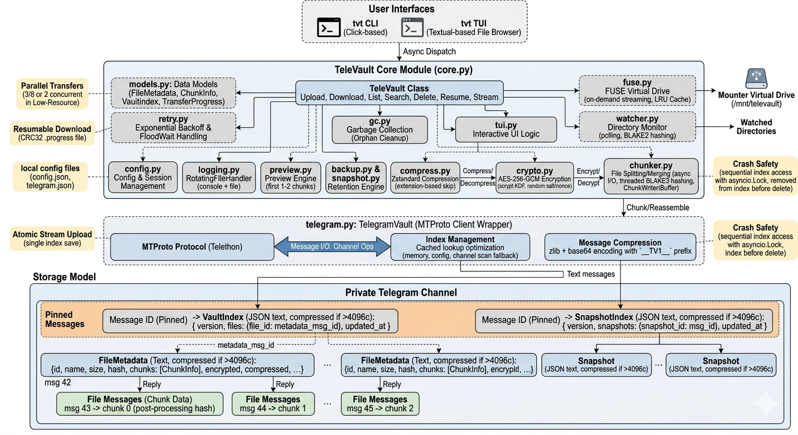

<p align="center">
  
  
  
  
  <a href="https://ko-fi.com/yahyatoubali"></a>
</p>

<h1 align="center">
  
  <br>
  Unlimited cloud storage via Telegram
</h1>

<p align="center">
  <strong>Encrypt → Chunk → Upload to your private Telegram channel.</strong><br>
  <strong>No servers. No limits. No trust required.</strong>
</p>

<p align="center">
  <a href="#building"><code>cmake -B build && cmake --build build</code></a>
  <span>&nbsp;·&nbsp;</span>
  <a href="#quick-start">Quick Start</a>
  <span>&nbsp;·&nbsp;</span>
  <a href="#project-structure">Structure</a>
</p>

---

## System Architecture

<p align="center">
  
</p>

---

## Why TeleVault?

| | TeleVault | Cloud Storage |
|---|---|---|
| **Cost** | Free (Telegram account) | $5-30/month |
| **Storage Limit** | Unlimited | 15 GB - 2 TB |
| **Encryption** | AES-256-GCM client-side | Server-side or none |
| **Trust Model** | Zero-trust (you hold the key) | Trust the provider |
| **File Size** | Up to 2 GB per file | Varies |
| **Speed** | 8 parallel chunk uploads | Single connection |
| **Low-resource** | Built-in mode for weak machines | N/A |

TeleVault turns a **private Telegram channel** into encrypted, unlimited cloud storage. No local database — everything lives as pinned messages and reply chains in the channel. Your password never leaves your machine.

---

## Features

- **End-to-end encryption** — AES-256-GCM with scrypt key derivation. Telegram only sees ciphertext.
- **Parallel transfers** — 8 upload, 10 download concurrent chunks. 256 MB default chunk size.
- **Resumable uploads/downloads** — CRC32-protected progress files survive interruptions.
- **Data safety** — Atomic config writes, sequential index access (asyncio.Lock), cached index lookups, crash-safe delete/upload/stream.
- **Low-resource mode** — `--low-resource` flag for machines with <2 GB RAM (32 MB chunks, 2 parallel ops).
- **Progress display** — Phase icons, chunk counter, EMA-smoothed speed (e.g. `3/8 chunks  12.3 MB/s`).
- **Git-like backups** — Incremental snapshots with retention policies.
- **FUSE mount** — Mount your vault as a local filesystem with on-demand streaming.
- **WebDAV server** — Access files over HTTP from any device.
- **Terminal UI (beta)** — Interactive file browser with detail panel.
- **Piping** — `cat file | tvt push -`, `tvt cat file | jq`, `tvt ls --json`.
- **Auto-backup** — Schedules, systemd timers, file watching.
- **Garbage collection** — Find and remove orphaned messages (dry-run by default, auto-cleans stale index entries).
- **Async I/O** — Non-blocking file hashing with ThreadPoolExecutor + aiofiles.

---

## Building

### Dependencies

| Library | Purpose | Ubuntu 24.04 |
|---|---|---|
| **tdlib** | Telegram MTProto client | `libtd-dev` |
| **OpenSSL** | AES-256-GCM + scrypt | `libssl-dev` |
| **libzstd** | Compression | `libzstd-dev` |
| **libblake3** | BLAKE3 hashing | `libblake3-dev` |
| **Boost.Asio** | Async I/O | `libboost-dev` |
| **libfuse3** | FUSE mount (optional) | `libfuse3-dev` |
| **FTXUI** | TUI (optional) | FetchContent |
| **CLI11** | CLI framework | FetchContent |
| **nlohmann/json** | JSON | FetchContent |

### Build

```bash
# Install system dependencies (Ubuntu 24.04)
sudo apt install cmake g++-14 libtd-dev libssl-dev libzstd-dev \
                 libblake3-dev libboost-dev libfuse3-dev

# Configure & build
cmake -B build -DCMAKE_BUILD_TYPE=Release
cmake --build build -j$(nproc)

# Optional: disable FUSE/WebDAV/TUI if not needed
cmake -B build -DTV_BUILD_FUSE=OFF -DTV_BUILD_WEBDAV=OFF -DTV_BUILD_TUI=OFF
cmake --build build -j$(nproc)

# Run tests
ctest --test-dir build --output-on-failure
```

### Run

```bash
# The binary is at build/src/televault
./build/src/televault login
./build/src/televault setup
./build/src/televault push photo.jpg

# Or symlink to PATH
ln -s "$(pwd)/build/src/televault" ~/.local/bin/tvt
tvt ls
```

---

## Quick Start

```bash
# 1) Login (will prompt for API credentials from https://my.telegram.org)
tvt login

# 2) Set up storage (interactive — validates channel, sends test message)
tvt setup

# 3) Upload
tvt push photo.jpg

# 5) List
tvt ls

# 6) Download
tvt pull photo.jpg

# 7) Stream to stdout
tvt cat photo.jpg > photo_copy.jpg

# 8) Preview without full download
tvt preview photo.jpg

# 9) Check channel info
tvt channel
```

---

## Usage

### Core Commands

```bash
tvt push <file>              # Upload a file (use - for stdin)
tvt pull <file>              # Download (use -o - for stdout)
tvt ls [--json]              # List files
tvt cat <file>               # Stream file to stdout
tvt preview <file>           # Preview without full download
tvt find <query> [--json]    # Search files
tvt info <file> [--json]     # Detailed file info
tvt stat [--json]            # Vault statistics
tvt rm <file>                # Delete file
tvt verify <file>            # Verify integrity
tvt gc [--force]             # Garbage collection (dry-run by default)
tvt whoami                   # Show account info
tvt login                    # Authenticate
tvt setup                    # Configure channel (interactive)
tvt channel                  # Show channel info
tvt tui                      # Launch terminal UI (beta)
```

### Pipeable I/O

```bash
echo "hello" | tvt push - --name note.txt
cat config.json | tvt push - --name config.json
mysqldump mydb | tvt push - --name backup.sql

tvt cat config.json | jq '.database'
tvt ls --json | jq '.[].name'
tvt find "backup" --json | jq '.[].size'
```

### Low-Resource Mode

For machines with limited RAM or CPU (<2 GB RAM):

```bash
tvt push bigfile.zip --low-resource
tvt pull bigfile.zip --low-resource
```

Uses 32 MB chunks, max 2 parallel operations, single-threaded hashing. Peak RAM usage ~64 MB.

### Backup & Restore

```bash
tvt backup create /data --name daily
tvt backup create /data --name incr --incremental
tvt backup list
tvt backup restore <id> --output /restore
tvt backup prune --keep-daily 7 --keep-weekly 4
tvt backup verify <id>
```

### Virtual Drive

```bash
# FUSE mount with on-demand streaming
tvt mount -m ~/televault-drive

# WebDAV server
tvt serve --host 0.0.0.0 --port 8080
```

### Auto-Backup

```bash
tvt schedule create /data --name daily --interval daily
tvt schedule install daily     # systemd timer (Linux)
tvt schedule list
tvt watch --path /data        # Watch for changes
```

---

## Security

```
Your Machine                              Telegram Servers
─────────────                             ────────────────
Original File
     │
     v
┌──────────────┐
│  BLAKE3 Hash │  ◄── Chunk integrity
├──────────────┤
│ zstd Compress│  ◄── Optional, skips incompressible files
├──────────────┤
│ AES-256-GCM  │  ◄── scrypt-derived key, per-chunk salt+nonce
├──────────────┤     44 bytes overhead per chunk
│  BLAKE3 Hash │  ◄── Ciphertext integrity
├──────────────┤
└──────────────┘
     │
     v
  Encrypted chunks sent via MTProto
     │
     v
  Telegram only sees encrypted blobs
```

Your password **never** leaves your machine. Telegram servers see only encrypted data and JSON metadata references.

> **If you lose your password with encryption enabled, there is no recovery.**

---

## Data Safety

- **Retry logic** — All operations retry 3x with exponential backoff + FloodWait handling
- **Sequential index access** — `asyncio.Lock` prevents concurrent uploads from overwriting each other
- **Atomic config writes** — Temp file + `os.replace` + `fsync` prevents corruption on crash
- **Upload cleanup** — Failed uploads automatically delete orphaned messages
- **Hash verification** — Every chunk verified with BLAKE3 on download
- **Original hash** — Separate pre-encryption hash catches wrong-password errors
- **Progress integrity** — CRC32 checksums on resume files detect corruption; partial files preserved on failure
- **Crash-safe stream** — Single index save with correct filename, no double-save window
- **Cached index lookups** — O(1) message ID fetch prevents data loss from index scans
- **Garbage collection** — Dry-run by default, pinned messages always protected, stale entries auto-cleaned
- **Async hashing** — File hashing runs in thread pool, never blocks the event loop
- **Input validation** — FileMetadata, ChunkInfo, VaultIndex validate fields on deserialization

---

## Configuration

**Config**: `~/.config/televault/config.json`

```json
{
  "channel_id": -1001234567890,
  "index_msg_id": 42,
  "snapshot_index_msg_id": 150,
  "chunk_size": 268435456,
  "compression": true,
  "encryption": true,
  "parallel_uploads": 8,
  "parallel_downloads": 10,
  "use_async_io": true,
  "low_resource_mode": false,
  "max_retries": 3,
  "retry_delay": 1.0
}
```

**Credentials**: `~/.config/televault/telegram.json` (set interactively via `tvt login`, or via env vars `TELEGRAM_API_ID` / `TELEGRAM_API_HASH` for advanced use)

**Log**: `~/.local/share/televault/televault.log`

---

## Project Structure

```
src/
├── main.cpp                # Entry point, CLI dispatch, signal handling
├── cli/                    # CLI framework (CLI11)
│   ├── cli.cpp/hpp         # 20+ commands: login, push, pull, ls, cat, info, stat, rm, ...
│   └── progress.hpp        # SpeedTracker, ProgressBar
├── telegram/               # Tdlib integration
│   ├── client.cpp/hpp      # Auth, channel ops, messages, file upload/download
│   ├── auth.cpp/hpp        # Phone → code → 2FA auth flow
│   └── session.cpp/hpp     # Tdlib database directory management
├── crypto/                 # AES-256-GCM via OpenSSL
│   ├── aes256gcm.cpp/hpp   # Per-chunk encrypt/decrypt with random nonce
│   ├── kdf.cpp/hpp         # scrypt (N=2¹⁷ r=8 p=1)
│   └── stream.cpp/hpp      # Streaming encryptor/decryptor
├── compress/               # zstd via libzstd
│   ├── zstd.cpp/hpp        # Compress/decompress, extension skip list
│   └── stream.cpp/hpp      # ZSTD_CCtx/DCtx streaming
├── chunker/                # File splitting + BLAKE3
│   ├── chunker.cpp/hpp     # iter_chunks sync/async
│   ├── hash.cpp/hpp        # BLAKE3 hashing (data + file)
│   └── writer.cpp/hpp      # Pre-allocated random-access ChunkWriter
├── core/                   # Vault engine
│   ├── vault.cpp/hpp       # Upload: hash→chunk→compress→encrypt→upload→index
│   │                       # Download: fetch→decrypt→decompress→verify→write
│   ├── index.cpp/hpp       # VaultIndex as pinned message (thread-safe)
│   ├── transfer.cpp/hpp    # Parallel transfer manager
│   └── app_context.cpp/hpp # App context (client + vault lifecycle)
├── backup/                 # Snapshot engine
│   ├── engine.cpp/hpp      # create/restore/list/delete/prune/verify
│   └── snapshot.cpp/hpp    # Snapshot index management
├── watcher/                # Polling file watcher
│   └── watcher.cpp/hpp     # BLAKE2b change detection, exclusion patterns
├── schedule/               # Backup scheduler
│   ├── schedule.cpp/hpp    # JSON schedule CRUD
│   └── systemd.cpp/hpp     # systemd timer/service generation
├── preview/                # File preview
│   └── preview.cpp/hpp     # ~90 extensions, text/hex/image preview
├── gc/                     # Garbage collection
│   └── gc.cpp/hpp          # Orphan detection, partial cleanup
├── fuse/                   # FUSE (libfuse3)
│   ├── fuse_ops.cpp/hpp    # getattr/readdir/read/open
│   └── cache.cpp/hpp       # LRUChunkCache
├── webdav/                 # WebDAV (Boost.Beast)
│   ├── server.cpp/hpp      # HTTP server
│   └── handler.cpp/hpp     # PROPFIND/GET/PUT/DELETE
├── tui/                    # Terminal UI (FTXUI)
│   └── tui.cpp/hpp         # File browser DataTable
├── util/                   # Infrastructure
│   ├── logging.cpp/hpp     # spdlog console + rotating file
│   ├── config.cpp/hpp      # XDG-compliant config JSON
│   ├── retry.cpp/hpp       # Exponential backoff with jitter
│   ├── format.cpp/hpp      # format_size, format_speed
│   └── platform.cpp/hpp    # System info, terminal detection
├── models/                 # Data types with nlohmann/json
│   ├── file_metadata.hpp   # FileMetadata, ChunkInfo
│   ├── vault_index.hpp     # VaultIndex
│   ├── snapshot.hpp        # Snapshot, RetentionPolicy
│   ├── config.hpp          # Config, RetryConfig, TelegramConfig
│   └── transfer_progress.hpp
└── async/                  # Boost.Asio executor
    └── executor.cpp/hpp    # io_context + thread pool singleton

tests/
├── CMakeLists.txt           # GTest build
├── test_crypto.cpp          # 6 tests: KDF, round-trip, corruption, large data, nonce
├── test_compression.cpp     # 5 tests: round-trip, skip list, levels, streaming
├── test_chunker.cpp         # 5 tests: hash, chunk, writer
├── test_models.cpp          # 4 tests: serialization round-trips
└── test_retry.cpp           # 3 tests: backoff, success, failure
```

---

## Contributing

**Quick start:**

```bash
git clone https://github.com/YahyaToubali/televault.git
cd televault
git checkout needspeed

# Install dependencies (Ubuntu 24.04)
sudo apt install cmake g++-14 clang++-18 libtd-dev libssl-dev \
                 libzstd-dev libblake3-dev libboost-dev libfuse3-dev

# Build & test
cmake -B build -DCMAKE_BUILD_TYPE=Debug -DTV_BUILD_TESTS=ON
cmake --build build -j$(nproc)
ctest --test-dir build --output-on-failure
```

All PRs target the `needspeed` branch.

---

## License

MIT License — See [LICENSE](./LICENSE) for details.

**Author**: Yahya Toubali · [@yahyatoubali](https://github.com/YahyaToubali)
