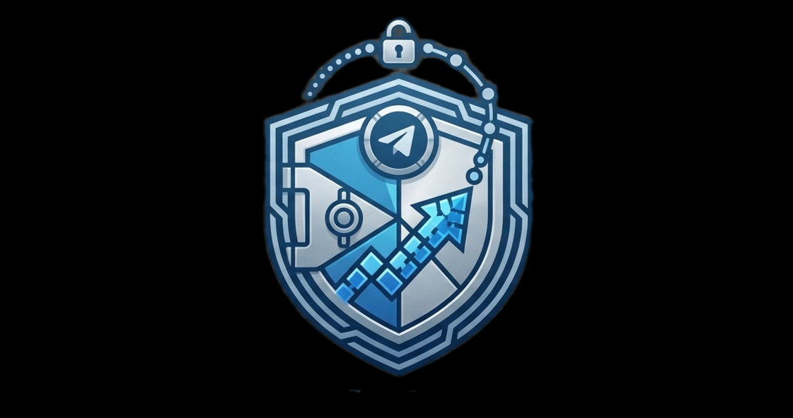

<p align="center">
  
  
  
  
  
  
  
  <a href="https://yahyatoubali.github.io/televault/"></a>
  <a href="https://ko-fi.com/yahyatoubali"></a>
</p>

<h1 align="center">
  
  <br>
  High-Performance Encrypted Cloud Storage via Telegram (C++23 Native)
</h1>

<p align="center">
  <strong>Encrypt → Chunk → Upload directly to your private Telegram channel.</strong><br>
  <strong>Zero servers. Zero cloud subscriptions. Zero trust required.</strong>
</p>

<p align="center">
  <a href="https://yahyatoubali.github.io/televault/">📖 Official Docs</a>
  <span>&nbsp;·&nbsp;</span>
  <a href="#quick-install-pre-built-binaries">📦 Quick Install</a>
  <span>&nbsp;·&nbsp;</span>
  <a href="#build-from-source">🛠️ Build from Source</a>
  <span>&nbsp;·&nbsp;</span>
  <a href="#command-reference">💻 Commands</a>
  <span>&nbsp;·&nbsp;</span>
  <a href="ARCHITECTURE.md">🏗️ Architecture</a>
  <span>&nbsp;·&nbsp;</span>
  <a href="docs/multiarch.md">🌐 Multi-Arch</a>
</p>

---

## Why TeleVault?

| Feature | TeleVault v4.0.0 | Traditional Cloud Storage |
|---|---|---|
| **Cost** | 100% Free (your Telegram account) | $5 - $30 / month |
| **Storage Limit** | Unlimited | 15 GB - 2 TB |
| **Encryption** | Client-side AES-256-GCM | Server-side or unencrypted |
| **Trust Model** | Zero-trust (you hold keys & salts) | Trust the provider |
| **File Chunking** | Multi-threaded Blake3-verified streams | Black-box uploads |
| **Throughput** | Native C++23 / TDLib MTProto engine | Browser / Python wrappers |
| **Snapshot Backups** | Isolated GFS retention engine | Expensive snapshot add-ons |

TeleVault turns a **private Telegram channel** into an encrypted, unlimited cloud storage drive. No local database is needed — everything lives as pinned index messages and reply chains in the channel. Plaintext data and passwords never leave your machine.

---

## Quick Install (Pre-built Binaries)

TeleVault provides pre-compiled native binaries for **Linux** (`x86_64`, `aarch64`) and **macOS Darwin** (`arm64` Apple Silicon, `x86_64` Intel) from [GitHub Releases](https://github.com/yahyatoubali/televault/releases/latest):

### Homebrew (macOS & Linux)

```bash
brew tap yahyatoubali/televault https://github.com/yahyatoubali/televault
brew install televault
```

### Universal One-Liner (Linux & macOS)

```bash
curl -fsSL https://raw.githubusercontent.com/yahyatoubali/televault/main/scripts/install.sh | bash
```

### Manual Download

```bash
# Auto-detect your OS and CPU architecture
OS=$(uname -s | tr '[:upper:]' '[:lower:]')
ARCH=$(uname -m)
[ "$ARCH" = "x86_64" ] && [ "$OS" = "linux" ] && TARGET="linux-x86_64"
[ "$ARCH" = "aarch64" ] || [ "$ARCH" = "arm64" ] && [ "$OS" = "linux" ] && TARGET="linux-aarch64"
[ "$ARCH" = "arm64" ] && [ "$OS" = "darwin" ] && TARGET="darwin-arm64"
[ "$ARCH" = "x86_64" ] && [ "$OS" = "darwin" ] && TARGET="darwin-x86_64"

# Download and unpack
curl -sLO "https://github.com/yahyatoubali/televault/releases/latest/download/televault-v4.0.0-${TARGET}.tar.gz"
tar -xzf "televault-v4.0.0-${TARGET}.tar.gz"
cd "televault-v4.0.0-${TARGET}"

# Install to system PATH
sudo cp televault /usr/local/bin/televault
sudo ln -sf /usr/local/bin/televault /usr/local/bin/tvt

# Verify
tvt --version
```

---

## Build from Source

### Dependencies

```bash
# Ubuntu / Debian
sudo apt update && sudo apt install -y \
    cmake g++-14 libtd-dev libssl-dev libzstd-dev \
    libblake3-dev libboost-dev pkg-config

# Arch Linux
sudo pacman -S cmake gcc tdlib openssl zstd blake3 boost

# macOS (Homebrew)
brew install cmake boost openssl@3 zstd pkg-config
```

### Compile & Test

```bash
# Configure release build
cmake -B build -DCMAKE_BUILD_TYPE=Release -DTV_BUILD_TESTS=ON

# Build native binary
cmake --build build -j$(nproc)

# Run full test suite (8 GTest suites)
ctest --test-dir build --output-on-failure

# Install to local prefix
cmake --install build --prefix ~/.local
```

---

## Quick Start Guide

```bash
# 1) Authenticate with Telegram (phone code, 2FA, or interactive QR code)
tvt login

# 2) Setup storage channel (interactive channel creator & validator)
tvt setup

# 3) Launch the interactive Terminal User Interface (TUI)
tvt tui

# Or use direct CLI commands:
# 4) Push a file to the vault
tvt push document.pdf

# 5) List files in your vault
tvt ls

# 6) Instant sub-second preview without full download
tvt preview document.pdf

# 7) Download file
tvt pull document.pdf -o ./downloaded_doc.pdf
```

---

## Command Reference

### Interactive Terminal User Interface (`tvt tui`)

TeleVault features a rich, responsive terminal UI built natively with [FTXUI](https://github.com/ArthurSonzogni/FTXUI):

```bash
tvt tui
```

- **Browse & Filter**: Arrow keys / `j`/`k` list navigation, `/` real-time search filter.
- **Instant Preview**: Press `p` for chunk-0 syntax-highlighted text or hex dump preview.
- **Transfers**: Press `u` for interactive upload modal, `d` for download modal with live progress gauge.
- **File Management**: Press `x` / `Del` for safe deletion modal, `r` / `F5` to refresh from channel, `?` for full help.

### Core Vault Operations

```bash
tvt push <file>              # Upload with FastCDC content deduplication & compression
tvt pull [query]             # Smart pull: interactive picker if omitted, fuzzy match & auto-named
tvt stream <file> [--port]   # Stream 4K video/audio via HTTP Range (206 Partial Content) to VLC/browser
tvt cat <file>               # Stream file directly to stdout
tvt preview <file>           # Sub-second chunk-0 preview with syntax & MIME detection
tvt ls [-w|--wide] [--json]  # Dynamic terminal-width formatted file listing
tvt find <query> [-e ext]    # Search vault with extension/size filters & substring highlighting
tvt info <file> [--json]     # Detailed file metadata and chunk topology
tvt stat [--json]            # Total vault size and file count statistics
tvt rm <file>                # Delete file and all chunk messages from Telegram
tvt verify <file>            # Verify chunk integrity against channel state
tvt recover                  # Self-healing index recovery from channel history
tvt completion <shell>       # Generate autocompletion for bash, zsh, or fish
```

### Snapshot Backup Management (`tvt backup`)

TeleVault includes a dedicated, isolated snapshot engine that guarantees your primary vault index is never touched:

```bash
# Create snapshot of directories with relative path preservation
tvt backup create /path/to/data -n "my_backup" -p "SecretPass123!"

# Incremental snapshot (skips unchanged files)
tvt backup create /path/to/data --incremental

# List all snapshots
tvt backup list

# Restore snapshot to destination with path-traversal (CWE-22) protection
tvt backup restore <snapshot_id> -o /tmp/restored -p "SecretPass123!"

# Prune old snapshots with Grandfather-Father-Son (GFS) retention
tvt backup prune --keep-daily 7 --keep-weekly 4 --keep-monthly 6

# Delete a specific snapshot
tvt backup delete <snapshot_id>
```

### Real-Time Directory Watcher (`tvt watch`)

```bash
# Watch a directory and automatically encrypt & sync changes to Telegram
tvt watch /home/user/documents -p "SecretPass123!" --exclude "*.tmp" ".git/*"
```
Press `Ctrl+C` at any time to shut down the watcher cleanly with zero orphan locks.

---

## Cryptographic Security Pipeline

```
Original Plaintext File
     │
     ▼
Multi-Threaded Chunker (100 MB default; 32 MB low-resource)
     │
     ▼
Blake3 Plaintext Integrity Hash (original_hash)
     │
     ▼
Zstandard Compression (level 3) -- auto-skips incompressible binaries
     │
     ▼
OpenSSL 3 AES-256-GCM Encryption
  ├── Argon2id / PBKDF2 with dual-salt fallback
  ├── Random 12-byte Nonce per chunk
  └── 16-byte Authentication Tag
     │
     ▼
Blake3 Ciphertext Verification Hash (hash)
     │
     ▼
Uploaded via TDLib MTProto directly to private storage channel
```

---

## Contributing

```bash
git clone https://github.com/yahyatoubali/televault.git
cd televault
git checkout dev

# Build and run tests
cmake -B build -DCMAKE_BUILD_TYPE=Debug -DTV_BUILD_TESTS=ON
cmake --build build -j$(nproc)
ctest --test-dir build --output-on-failure
```

All contributions and PRs target the `dev` branch. `main` is reserved for tagged releases.

---

## Disclaimer

### Not Affiliated with Telegram

TeleVault is an independent, community-driven open-source project. It is **not** endorsed by, affiliated with, or officially connected to Telegram or Telegram FZ-LLC in any way.

### Telegram Terms of Service Compliance

Using Telegram channels as file storage is not the explicitly intended use of the platform. While Telegram's Bot API and MTProto API are publicly available and TeleVault uses them through legitimate means, this use case exists in a gray area of Telegram's Terms of Service. Users should be aware that:

- Telegram may change their terms, API limits, or storage policies at any time without notice
- Excessive automated usage could trigger rate limits or account restrictions
- Telegram reserves the right to revoke API access for any reason
- There is no guarantee of data permanence on Telegram's servers
- Files or channels may be removed if Telegram deems them in violation of their policies

### User Responsibility

By using TeleVault, you accept sole responsibility for:

- Complying with [Telegram's Terms of Service](https://telegram.org/tos)
- Complying with [Telegram's API Terms of Service](https://core.telegram.org/api/terms)
- The legality of any files you store through this tool
- Maintaining your own backups of important data (do **not** rely on TeleVault as your only copy)
- Keeping your encryption password safe (there is no recovery mechanism if lost)

### No Warranty

This software is provided "as is", without warranty of any kind, express or implied. The authors and contributors are not liable for any data loss, account restrictions, service interruptions, or any other damages arising from the use of this software.

### Recommendation

Users should use TeleVault for **personal backup purposes only**. Please respect Telegram's rate limits, avoid commercial-scale storage operations, and never use this tool for distributing illegal content. If you are unsure whether your use case complies with Telegram's policies, review their terms directly or seek legal advice.

---

## License

MIT License — see [LICENSE](./LICENSE) for details.

**Author**: Yahya Toubali · [@yahyatoubali](https://github.com/yahyatoubali)
