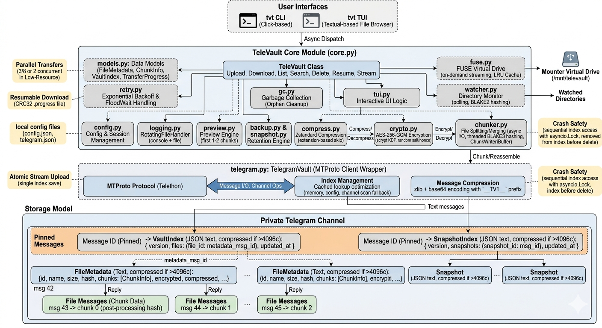

# The Engine

TeleVault uses a single private Telegram channel as its entire data store. There is no local database — all state lives on Telegram as pinned messages and reply chains.

## Message Topology

```
                   Channel (private)
                  ==================
                  |  Pinned: VaultIndex  |──── files: { "abc123": 42, "def456": 87 }
                  |  Pinned: SnapshotIndex|──── snapshots: { "snap01": 150 }
                  ==================
                         │
            ┌────────────┼────────────┐
            │                         │
      msg 42 (text/JSON)        msg 87 (text/JSON)
      FileMetadata for           FileMetadata for
      file "abc123"              file "def456"
            │                         │
      ┌─────┼─────┐            ┌──────┼──────┐
      │     │     │            │      │      │
    reply  reply  reply       reply   reply  reply
    msg43  msg44  msg45       msg88  msg89  msg90
    chunk0 chunk1 chunk2      chunk0 chunk1  chunk2
```

### How It Works

1. **Pinned VaultIndex** — A single pinned text message maps every file ID to its metadata message ID. This is the root pointer.
2. **FileMetadata** — Each file has a text/JSON message containing its name, size, hash, and chunk list.
3. **Reply Chains** — Each chunk is uploaded as a file message replying to its parent FileMetadata message. This creates a tree structure Telegram preserves.
4. **Pinned SnapshotIndex** — Same pattern for backup snapshots.

### Index Lookup

Two-tier caching for O(1) index retrieval:

1. **In-memory** — `TelegramVault._index_msg_id` cached during the session
2. **Config persistence** — `Config.index_msg_id` saved to disk between sessions
3. **Full channel scan** — Only as fallback when no cached ID exists (first run)

The index message ID is persisted after every save, so subsequent lookups never scan the channel.

### Message Compression

Telegram limits text messages to 4096 characters. Large indices are automatically compressed:

```
if len(json_text) > 4096:
    compressed = zlib.compress(json_text, level=9)
    encoded = base64.b64encode(compressed)
    message = f"__TV1__{encoded}"
```

Decompression is transparent — messages without the `__TV1__` prefix are read as plain JSON.

## Storage Model

### VaultIndex

```json
{
  "version": 7,
  "files": { "abc123def456": 42, "def789ghi012": 87 },
  "updated_at": 1700000100.0
}
```

The `version` field increments on each save. The save method finds the pinned message, reads its version, increments it, and edits the message in place. Retries only on Telegram API errors (3 attempts with exponential backoff).

### FileMetadata

```json
{
  "id": "abc123def456",
  "name": "photo.jpg",
  "size": 5242880,
  "hash": "a1b2c3d4...64 chars BLAKE3",
  "chunks": [
    {
      "index": 0,
      "message_id": 43,
      "size": 10485780,
      "hash": "e5f6a7b8...post-processing",
      "original_hash": "c9d0e1f2...pre-processing"
    }
  ],
  "encrypted": true,
  "compressed": true,
  "created_at": 1700000000.0
}
```

### Crash Safety

**Upload**: Data is uploaded to Telegram first, then the index is saved. If the process crashes after chunk upload but before index save, the data exists on Telegram but is not referenced. Run `tvt gc --clean-partials` to detect and clean incomplete uploads.

**Delete**: Index entry is removed first, then messages are deleted. If the process crashes after index removal, `tvt gc` finds and cleans the orphaned messages.

**Concurrent Access**: All index read-modify-write operations are serialized with `asyncio.Lock`. Concurrent uploads cannot silently overwrite each other's entries.

## Encryption Pipeline

### Upload

```
Original File
      │
      ▼
   Chunker (256 MB slices)
      │
      ▼
   BLAKE3 hash (original_hash)
      │
      ▼
   zstd Compression (level 3)
   ── skipped for incompressible extensions
      │
      ▼
   AES-256-GCM Encryption
   ── scrypt(password, salt) → 32-byte key
   ── 16-byte salt + 12-byte nonce = 28-byte header
   ── ciphertext + 16-byte auth tag
   ── overhead: 44 bytes per chunk
      │
      ▼
   BLAKE3 hash of encrypted data (ChunkInfo.hash)
      │
      ▼
   Upload as Telegram file message (reply to metadata)
```

### Download

```
Download chunk by message_id
      │
      ▼
   Verify BLAKE3 hash (ChunkInfo.hash)
      │
      ▼
   AES-256-GCM Decryption
   ── extract 28-byte header (salt + nonce)
   ── scrypt(password, salt) → key
   ── decrypt and verify GCM tag
      │
      ▼
   zstd Decompression
      │
      ▼
   Verify original_hash (BLAKE3)
   ── catches wrong-password decryption that passes GCM
      │
      ▼
   Write chunk at offset via ChunkWriter
      │
      ▼
   Verify file-level BLAKE3 hash (FileMetadata.hash)
```

## Architecture



## Key Derivation

```
scrypt(password, salt):
  N = 2^17 (131072)
  r = 8
  p = 1
  output = 32 bytes (256-bit AES key)
```

## Incompressible Extensions

Compression is skipped for files that are already compressed:

| Category | Extensions |
|---|---|
| Images | `.jpg` `.jpeg` `.png` `.gif` `.webp` `.heic` `.heif` `.avif` |
| Video | `.mp4` `.mkv` `.avi` `.mov` `.webm` `.m4v` `.wmv` `.flv` |
| Audio | `.mp3` `.aac` `.ogg` `.opus` `.flac` `.m4a` `.wma` |
| Archives | `.zip` `.gz` `.bz2` `.xz` `.7z` `.rar` `.zst` `.lz4` |
| Documents | `.pdf` `.docx` `.xlsx` `.pptx` `.odt` |
